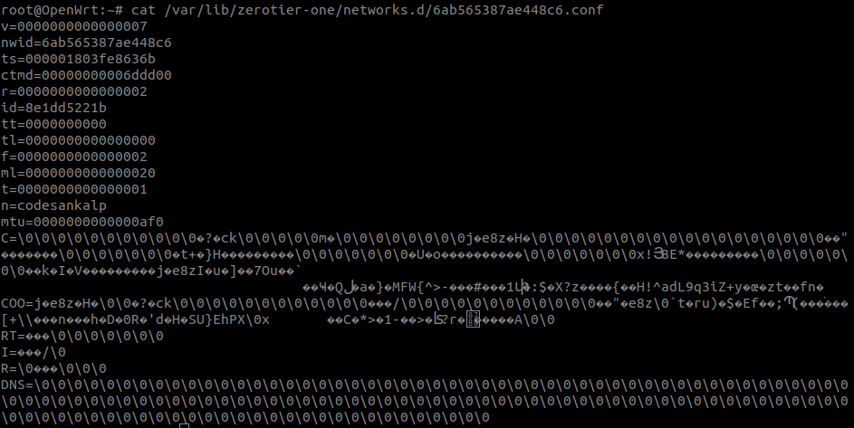

## ZeroTier backend in Netjsonconfig

1. Defining schema for the zerotier backend i.e. adding support for `zerotier-schema.json` in `schema.py`.
2. Adding support for that schema in `netjsonconfig.backends.zerotier.converter` and `netjsonconfig.backends.zerotier.parser`
3. Adding renderer and template for that schema.
4. Using all above mentioned things to create `ZeroTier` backend which will generate data for zerotier controller.

In this basic prototype a zerotier backend is developed in which a schema for name, id and enabled is defined.
Using that schema a converter and parser is written.



## Support for ZeroTier tunnels to OpenWRT backend 

The main aim of this feature is to generate zerotier configuration for OpenWrt.

The details of configuration is mentioned in https://github.com/mwarning/zerotier-openwrt/wiki

Steps to solve this:

1. Extending the zerotier converter for OpenWrt backend i.e. `openwrt/converters/zerotier.py`.
2. Using the extended converter to generate zerotier-openwrt syntax.

We can test this prototype using below code:

**Note**: Schema changes is needed, this is just a basic prototype to generate zerotier-openwrt syntax.

```python
from netjsonconfig.backends.openwrt.openwrt import OpenWrt
from netjsonconfig.backends.zerotier.zerotier import ZeroTier

config = {
    "zerotier": [
        {
            "name": "network1",
            "enableBroadcast": True,
            "id": "6ab565387ae448c5",
            "private": False,
        },
        {
            "name": "network2 sample",
            "enableBroadcast": False,
            "id": "8056c2e21c000009",
            "private": True,
        },
    ]
}

print(ZeroTier(config).render())
# output partially matches with conf in /var/lib/zerotier-one/{id}.conf:
"""
# zerotier config: 6ab565387ae448c5

enableBroadcast=True
n=network1
nwid=6ab565387ae448c5
private=False

# zerotier config: 8056c2e21c000009

enableBroadcast=False
n=network2
nwid=8056c2e21c000009
private=True
"""

print(OpenWrt(config).render())
# output will be:
"""
package zerotier

config zerotier 'network1_config'
        option enabled '1'
        list join '6ab565387ae448c5'

config zerotier 'network2_sample_config'
        option enabled '0'
        list join '8056c2e21c000009'
"""
```

### Steps to run prototype:

1. Checkout zerotier-prototype branch

    ```
    git clone git@github.com:codesankalp/netjsonconfig.git
    git checkout zerotier-prototype
    ```

2. Run tests to check the configuration generation

    ```
    p -m unittest tests/tests.py
    ```
