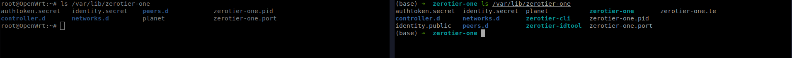
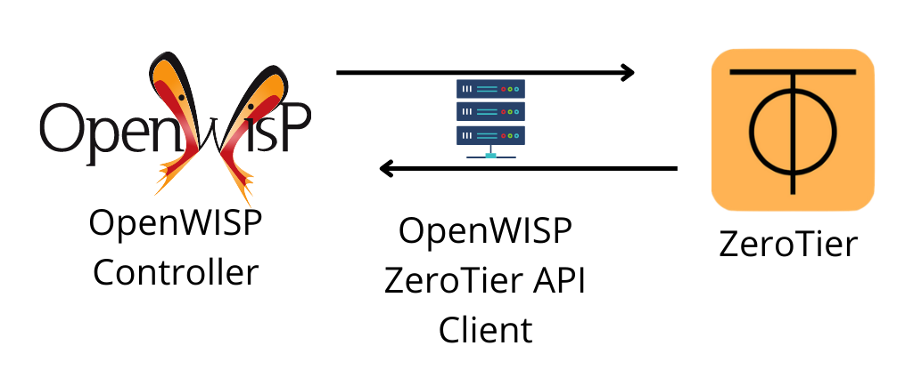

## Prototype Demo


## Run prototype:

1. Checkout zerotier-prototype branch

    ```
    git clone git@github.com:codesankalp/openwisp-controller.git
    git checkout zerotier-prototype
    ```

2. Run the development server.

## Implemented things in prototype:

- Added zerotier as a vpn backend
- Creating network using ZeroTier API while adding VPN in openwisp-controller.
- Added support for automatic template creation
- Used this template to add configuration in OpenWRT device.

**Note**: Some fields are irrelevant in the preview configuration. I will remove those fields in future and add more supported fields in netjsonconfig schema.

Prototype Code: https://github.com/codesankalp/openwisp-controller/tree/zerotier-prototype
## Support for ZeroTier VPN backend

1. Extending ZeroTier backend created in netjsonconfig to `vpn_backends.py`.
2. Adding vpn backend ZeroTier to `settings.py` i.e. settings.VPN_BACKENDS
3. Change the AbstractVpn and AbstractVpnClient to setup ZeroTier networks.
4. Generation of identity secret and identity public present in `/var/lib/zerotier-one`.



5. We can use tool [zerotier-idtool](https://man.archlinux.org/man/community/zerotier-one/zerotier-idtool.1.en) to generate these identity secrets.

```
zerotier-idtool generate identity.secret identity.public
```
6. Changing templates to automatic generate ZeroTier VPN backend configuration.


## Managing ZeroTier networks from OpenWISP -  REST API

1. Creating a separate zerotier api view i.e. `openwisp_controller.config.api.zerotier_views.py`.
2. In this zerotier_views all the external request will be made to zerotier host.
3. A request factory will be created for zerotier API which can be used or extended for managing network.
4. Request factory will contain all the methods to make API request for endpoints mentioned in https://docs.zerotier.com/central/v1/ 
5. We can create a separate package for this also because one that i found was not used.
6. Using this ZeroTier API for openwisp controller API where vpn backend is ZeroTier.




## Authorize member in ZeroTier network

If network is set to **private** in ZeroTier Vpn and to add a new device we need to make a REST API call to ZeroTier API authorize that device.

Url: `https://{host}/api/v1/network/{networkID}/member/{memberID}`

We will use the above implemented ZeroTier client to make this call.
