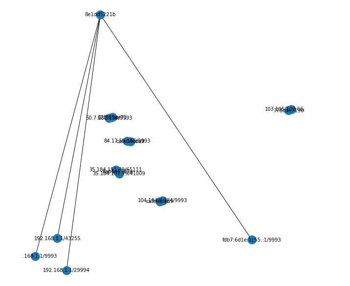

## Parser for ZeroTier to generate network topology

To get the peers information of devices in networks we can use either `zerotier-cli` or `API`.

To get peers information using cli run below command from one of the connected device to the network:

`zerotier-cli peers -j`

Other option is to use the [peer api](https://docs.zerotier.com/service/v1/#tag/peer):

1. Get all peers (`/peer`)
2. Get information about a specific peer by Node ID. (`/peer/{address}`)

We can use the openwisp zerotier api client implemented in openwisp controller to get this information.

Creating the parser for ZeroTier in **[netdiff](https://github.com/openwisp/netdiff)** and extending it in openwisp-network-topology.

See `data.json` for peers information and `zerotier.py` to see prototype of parser.

## How to run prototype

```python

import json
import networkx

data = json.loads(open('data.json', 'r').read())
graph = ZeroTierParser(data).parse(data)

# use in jupyter notebook
networkx.draw(graph, with_labels=True, font_size=12)
```

The above code loads the peers data from `data.json` and passes it into `netdiff.parsers.ZeroTierParser` to return a graph with all nodes paths.

## Output


